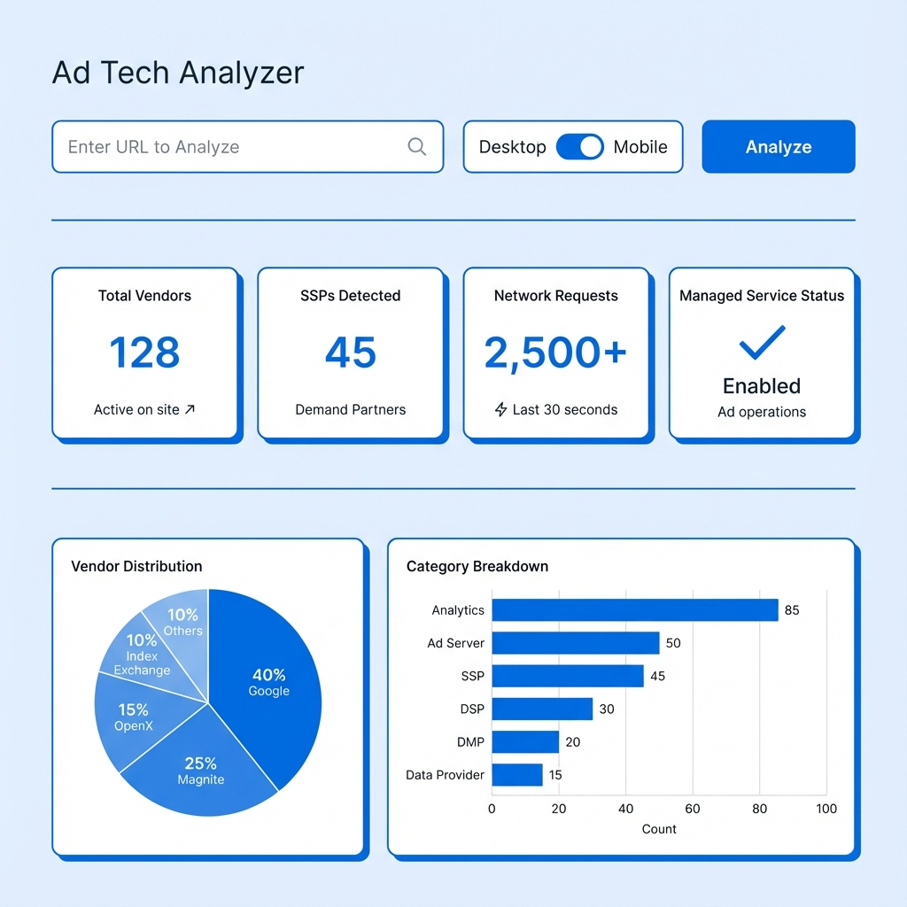
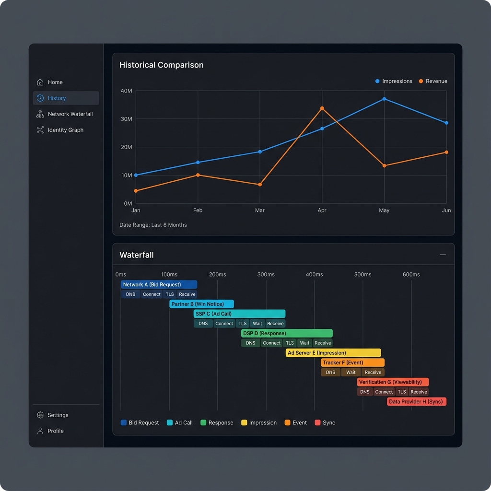
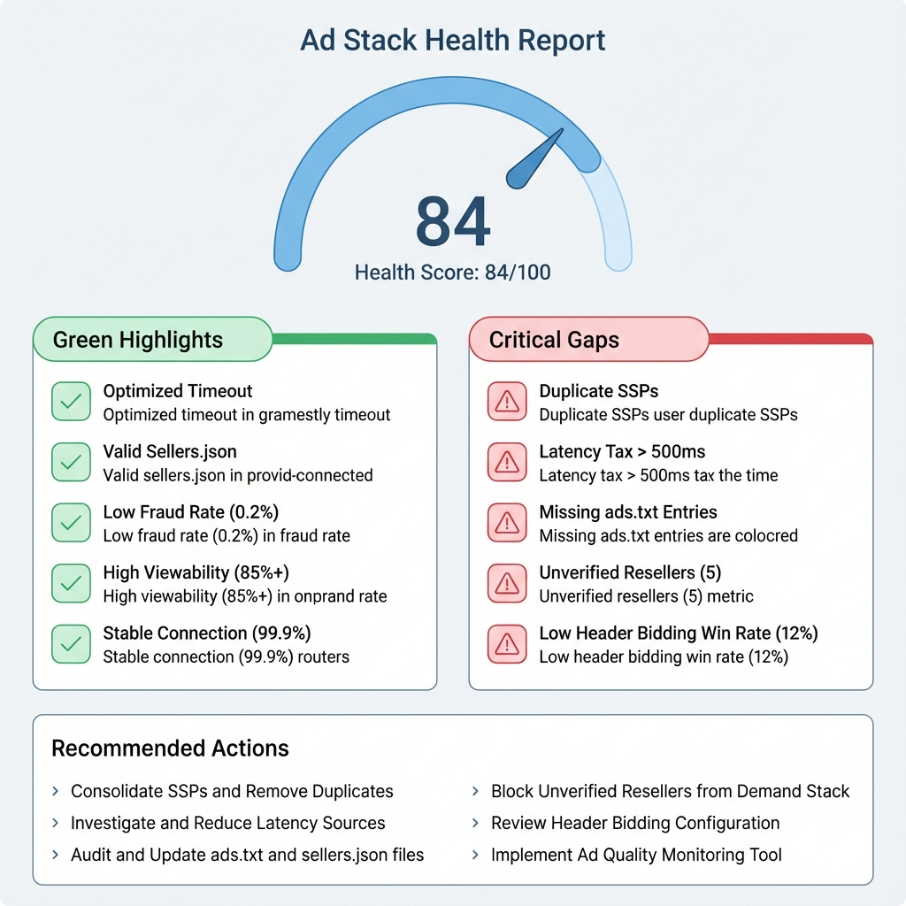

# Product Requirements Document: Ad Tech Analyser

## 1. Product Vision
The **Ad Tech Analyser** is a specialized platform designed for digital publishers, ad operations teams, and privacy auditors. It provides a "transparent lens" into the complex, often opaque ad tech stacks running on any website. By combining real-time network analysis with runtime browser inspection, it uncovers the exact vendors, wrappers, and configurations powering a site's monetization.

---

## 2. Target Audience
- **Ad Ops Engineers**: To debug configuration issues and verify partner implementations.
- **Yield Managers**: To understand competitor stacks and identify managed service providers.
- **Privacy Auditors**: To verify data-sharing partners and consent management compliance.
- **Agency Analysts**: To audit client sites for implementation efficiency.

---

## 3. Core Features (Current - v1.0)

### 3.1 CLI Site Analysis
- **Execution**: Run localized scans via CLI (`analyze-site.ts`).
- **Detection**: Identifies SSPs, Ad Servers, Managed Services, and Identity providers via regex-based network classification.
- **Output**: Generates detailed JSON reports containing raw and classified data.

### 3.2 Hybrid Analysis Engine
- **Network Capture**: Monitors all outgoing requests during page load.
- **Runtime Bridge**: Injects a sophisticated "bridge" script into the browser context to hook into `pbjs` (Prebid) and `googletag` (GAM) objects.
- **Cross-Validation**: Compares network findings with runtime state to ensure high-confidence reporting.

### 3.3 Interactive Dashboard
- **Overview**: High-level stats cards (Vendor count, SSPs, Managed Service status).
- **Visualization**: Pie and Bar charts for vendor distribution by category.
- **Deep Dives**:
    - **Prebid.js Panel**: Displays price granularity, timeouts, and currency.
    - **GAM Panel**: Lists ad slots, sizes, and custom targeting keys.

---

## 4. Visual Wireframes

### 4.1 Dashboard Overview (Current)

### 4.2 Enhanced Dashboard (Future Roadmap)

### 4.3 Ad Stack Health Report

---

## 5. Future Scope & Roadmap (v2.0+)

### 5.1 Browser Extension Integration
- **Feature**: Port the core analyzer logic into a Chromium-based extension.
- **Scope**:
    - **Live Overlay**: A sidebar or popup that displays real-time ad tech data as the user browses.
    - **Event Stream**: Capture "dynamic" events (like refreshes or mid-roll triggers) that static scans might miss.
    - **One-Click Audit**: Allow users to trigger a full site scan directly from their current active tab.

### 5.2 Automated "Ad Stack Health" Reports (AdPushup Standard)
- **Feature**: An executive JSON/PDF report that moves from *observation* to *recommendation*.
- **Audit Areas (Inspired by AdPushup)**:
    - **Header Bidding Deep-Dive**: Analysis of ad refresh triggers (time-based vs. event-based), price floors, and auction timeouts.
    - **Demand Optimization**: Evaluation of bidder diversity (SSPs like Pubmatic/OpenX) and server-side vs. client-side balance.
    - **GPT/GAM Setup Audit**: Detection of granularity settings ($0.01 vs $0.50), line item efficiency, and use of fluid/native sizes.
    - **Ad Unit UX**: Categorization of "Sticky," "Docked," and "Rewarded" ad units.
- **The "Highs & Lows" Model**:
    - **Good Things**: Highlights best practices found (e.g., "Prebid timeout is optimized for UX," "Sellers.json validated").
    - **Gaps & Critical Issues**: Flags inefficiencies or errors (e.g., "Multiple wrappers causing latency," "Missing privacy consent signal," "Orphaned GAM slots").
- **Scoring System**:
    - A 100-point weighted score across categories (Header Bidding: 25 pts, Demand: 25 pts, GPT Setup: 20 pts, Ad Units: 15 pts, Adblock: 15 pts).

### 5.3 Expanded Depth of Analysis
- **Advanced Tactics**: Detect bid shading, floor price strategies, and dynamic auction pressure.
- **Sellers.json & App-ads.txt**: Automatically cross-reference detected vendors against the site's authorization files to identify unauthorized demand.
- **Latency Attribution**: Measure the exact "tax" (in milliseconds) each vendor adds to the page load time.

### 5.4 Persistence & Historical Analysis
- **Feature**: Integrate a SQLite database to store all analysis sessions.
- **Benefit**: Allows users to track stack changes over time and compare "Before vs After" for site updates.

### 5.5 Advanced Visualization
- **Network Waterfall**: An interactive timeline view of all ad-related requests.
- **Identity Graph**: Visual mapping of vendor-to-vendor dependencies (e.g., which SSP is calling which ID provider).

### 5.6 Performance & Robustness
- **Concurrent Job Queue**: Ability to queue multiple site analyses without blocking the UI.
- **Automated Alerts**: Notify users of misconfigurations (e.g., Prebid timeout too high, GAM slot errors).
- **Headless Detection Bypass**: Improved stealth to analyze sites with strict anti-bot measures (e.g., BBC).

### 5.7 Unified Data Contract
- **Feature**: Shared TypeScript interface library.
- **Benefit**: Ensures perfect synchronization between the Analyzer output and Dashboard input, eliminating the need for client-side data mapping.

---

## 6. Technical Stack
- **Core**: Node.js, TypeScript.
- **Collection**: Playwright, Chrome DevTools Protocol (CDP).
- **Frontend**: React, Vite, Tailwind CSS, Recharts.
- **Communication**: HTTP API bridge (Express) to underlying CLI/MCP logic.
